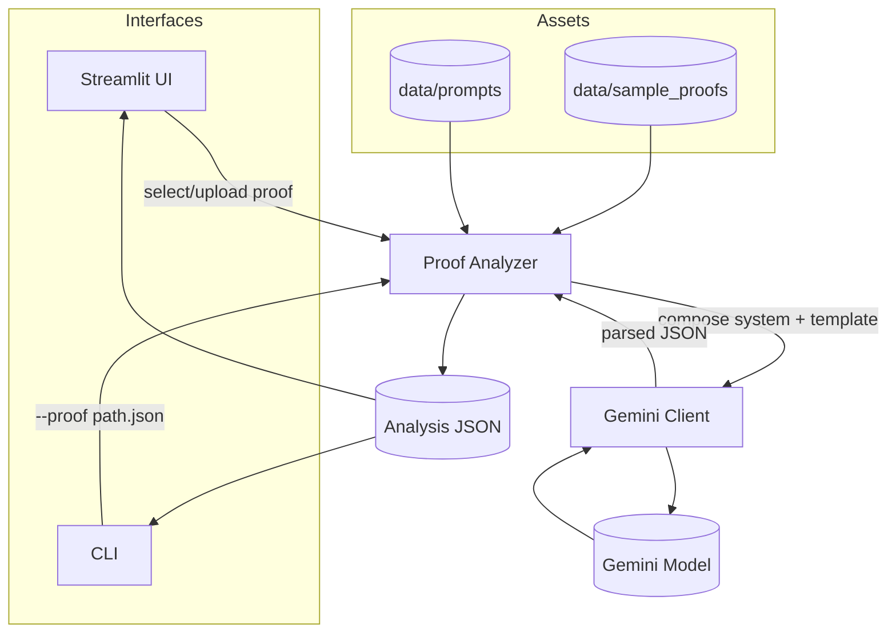

# Spot the Flaw: Math Proof Checker

This project operationalizes a research-centric investigation into automated verification and critique of mathematical arguments common in machine learning and probabilistic reasoning. It provides a reproducible pipeline for stepwise proof checking, error localization, and minimally invasive correction proposals using Gemini-class models, with emphasis on transparency, controllability, and evaluation.

## Motivation and Context

Mathematics is a core substrate for model capability: structured reasoning, symbolic manipulation, and rigorous inference underpin optimization, generalization, and safety. Progress on mathematical reasoning has repeatedly correlated with broader advances in sample efficiency and controllability of AI systems, as evidenced by:

- DeepMind’s synthetic curriculum work for procedural math reasoning, which exposed scaling and compositional generalization dynamics in LMs ([Saxton et al., 2019](https://arxiv.org/abs/1912.01412)).
- Google Research’s Minerva, demonstrating substantial gains on quantitative benchmarks via math-aware pretraining and prompting ([Lewkowycz et al., 2022](https://arxiv.org/abs/2206.14858)).
- DeepMind’s AlphaGeometry showing integration of symbolic engines with learned guidance to solve Olympiad-level geometry problems ([Nature, 2024](https://www.nature.com/articles/d41586-024-00483-9)).
- Benchmarks that stress formal and informal mathematical reasoning, including MATH ([Hendrycks et al., 2021](https://arxiv.org/abs/2103.03874)) and GSM8K ([Cobbe et al., 2021](https://arxiv.org/abs/2110.14168)).
- Dataset scaling efforts that increased access to technical/math text (e.g., EleutherAI’s The Pile; [Gao et al., 2021](https://arxiv.org/abs/2101.00027)).

Taken together, these works suggest that strengthening mathematical reasoning is both intrinsically valuable (toward scientific assistance) and instrumentally valuable (toward robustness, interpretability, and tool-use). This demo targets the practical layer: interactive, auditable proof analysis for ML/probability arguments.

## Aim

- Provide an interactive artifact to inspect and stress-test model reasoning on mathematical proofs relevant to ML (bias–variance, optimization convergence, Jensen applications, information-theoretic bounds).
- Localize errors at the step level, label them (correct/questionable/error), and propose minimal corrections with justification.
- Enable systematic prompting, ablations, and offline reproducibility (mock mode) to support research iteration and workshop use.

## System Overview

- Input: structured proof JSON with ordered steps and optional assumptions/notes.
- Prompting: a system prompt defines verification criteria; a template renders the proof into a constrained analysis request.
- Model: configurable Gemini-family model (default `gemini-2.5-pro`), with a deterministic mock pathway for offline runs.
- Output: a single JSON object capturing global status, per-step labels, issues, corrections, and a concise summary.
- Interfaces: Streamlit UI for interactive exploration; CLI for batch or scripted evaluation.

### How it Works



## Reproducibility and Controls

- Deterministic mock mode (`GEMINI_MOCK=1`) for offline demos/tests without external calls.
- Explicit prompt files in `data/prompts/` for versioning and ablations.
- Sample proofs (flawed and correct) for regression checks and pedagogy.

## Installation

### Prerequisites
- Python 3.9+
- Gemini API key (for live analysis)

### Setup

```bash
python -m venv venv
# Windows PowerShell
venv\Scripts\Activate.ps1
# macOS/Linux
# source venv/bin/activate

pip install -r requirements.txt

# Configure environment
copy env.example .env  # On Windows
# or: cp env.example .env
# Edit .env and fill GEMINI_API_KEY
```

## Usage

### UI (Interactive)

```bash
streamlit run src/ui/app.py
```

Select a bundled sample or upload a proof JSON to inspect stepwise labels, issues, and proposed corrections.

### CLI (Batch)

```bash
python src/main.py --proof data/sample_proofs/flawed/bias_variance.json
```

Writes a structured analysis JSON for downstream evaluation. (Module form is optional and not required.)

## Configuration
- `GEMINI_API_KEY` (required for live analysis)
- `GEMINI_MODEL_NAME` (optional; overrides default model)
- `GEMINI_MOCK=1` enables deterministic offline responses (useful for tests and demos)

## Evaluation Ideas

- Label consistency: agreement rates across multiple runs/settings for the same proof.
- Minimality of corrections: edit distance between original and corrected steps.
- Sensitivity: inject controlled perturbations (notation swaps, missing terms) and measure detection.
- Coverage: diversify topics (optimization, information theory, probabilistic inequalities) and difficulty.

## Limitations

- Output validity depends on prompt design and model configuration; formal guarantees are out of scope.
- JSON extraction uses best-effort parsing; malformed generations are wrapped with raw text in `summary`.
- Not a formal proof assistant; intended for exploratory analysis and teaching.

## Related References

- Saxton et al., 2019. “The Mathematics Dataset.” [arXiv](https://arxiv.org/abs/1912.01412)
- Lewkowycz et al., 2022. “Solving Quantitative Reasoning Problems with Language Models (Minerva).” [arXiv](https://arxiv.org/abs/2206.14858)
- DeepMind AlphaGeometry coverage (Nature, 2024). [Nature news](https://www.nature.com/articles/d41586-024-00483-9)
- Hendrycks et al., 2021. “Measuring Mathematical Problem Solving With the MATH Dataset.” [arXiv](https://arxiv.org/abs/2103.03874)
- Cobbe et al., 2021. “Training Verifiers to Solve Math Word Problems (GSM8K).” [arXiv](https://arxiv.org/abs/2110.14168)
- Gao et al., 2021. “The Pile: An 800GB Dataset of Diverse Text for Language Modeling.” [arXiv](https://arxiv.org/abs/2101.00027)

